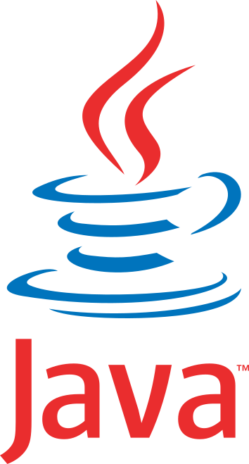
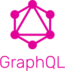
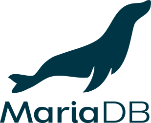

# CCTeam GraphQL

**Spring Boot** application to expose **GraphQL** endpoint for **CCTeam** mobile application.


---

# Table of Contents

* [About](#about)
* [Installation](#installation)
* [Usage](#usage)
* [Documentation](#documentation)
* [License](#license)

# About

<table>
  <tr>
    <td>
        
    </td>
    <td>
        
    </td>
    <td>
        
    </td>
    <td>
        
    </td>
    <td>
        
    </td>
  </tr>
</table>

This project holds the **GraphQL APIs** that expose data to be consumed by the **CCTeam** mobile application which is an
application for managing a motorbike racing club (members, tracks, events, etc.).

See the [ccteam-flutter](https://https://github.com/Yann39/ccteam-flutter) repository for more information about the
mobile application.

The application uses only a few starters and libraries :

- **Spring Boot Data JPA** starter as ORM
- **Spring Boot GraphQL** starter to expose data via GraphQL
- **Spring Boot Security** starter and **Auth0 Java JWT** library to handle security through **JWT**s
- **Lombok** library to avoid boilerplate code
- **MariaDB** client to connect to the database
- **Jacoco** / **Surefire** / **Failsafe** Maven plugins to handle tests and code coverage
- **Thymeleaf** to generate HTML form for the account deletion request

# Installation

To run the application locally :

1. Start a **MariaDB** instance on port `3306` :

    ```bash
    docker run \
    --name mariadb-ccteam \
    --restart on-failure \
    -p 3306:3306 \
    -e MARIADB_DATABASE=ccteam \
    -e MARIADB_ROOT_PASSWORD=rootpasswordhere \
    -e MARIADB_USER=ccteam \
    -e MARIADB_PASSWORD=userpasswordhere \
    -d docker.io/library/mariadb:10.5
    --character-set-server=utf8mb4 \
    --collation-server=utf8mb4_unicode_ci
    ```

   It should create a database `ccteam` and a user `ccteam`.

   Change the password and make sure to use the same values in your local properties configuration (you can create a new
   _application-local.properties_ file to override default properties ) for database connection string.

   If you already have a running MariaDB server, then you can create the database as follows :

    ```sql
    CREATE DATABASE ccteam CHARACTER SET utf8mb4 COLLATE utf8mb4_unicode_ci;
    ```

2. If you want **JPA** to create the database structure, set the following properties (in your
   _application-local.properties_ file) :

    ```properties
    spring.jpa.hibernate.ddl-auto=                      update
    ```

   And if you want to initialize the database with some default data, set the following properties (in your
   _application-local.properties_ file) :

    ```properties
    spring.sql.init.mode=                               always
    spring.jpa.defer-datasource-initialization=         true
    ```

   This will run the _src/main/resources/data.sql_ file to insert the data. The default password for every user is
   `123456`.

3. Run the application with the right profile :

   Simple run the **JAR** file either from your IDE, or using the following command :

    ```bash
    java -jar -Dspring.profiles.active=local ccteam-graphql.jar
    ```

### Tests

You can run the tests using :

```bash
mvn clean test
```

This will also generate an HTML coverage reports thanks to the **Jacoco** Maven plugin (along with the **Surefire** and
**Failsafe** Maven plugins). You will find it under _target\site\jacoco\index.html_

# Usage

The authentication/registration related endpoints are exposed via **REST** (as well as the avatars). Everything else is
exposed via **GraphQL**.

By default, local calls use:

- host: `http://localhost:5001`
- context path: `/ccteam-gql`

## Authentication

- `POST /rest/authenticate` returns a JWT token when credentials are valid.
- Protected endpoints (like `/graphql` and `/avatars/**`) must send this header:
  `Authorization: Bearer <token>`

Example authentication call:

```bash
curl -X POST "http://localhost:5001/ccteam-gql/rest/authenticate" \
  -H "Content-Type: application/json" \
  -d '{
    "email": "john.doe@example.com",
    "password": "123456",
    "deviceSecret": "my-device-id"
  }'
```

`deviceSecret` is a stable identifier for the current client device (for example one value generated once and stored by
the mobile app). It is used by the trusted-device flow: after successful passcode verification, an unknown
`deviceSecret` can require an additional e-mail OTP verification before issuing a JWT.

## Example REST calls

Retrieve an avatar (protected endpoint):

```bash
curl -X GET "http://localhost:5001/ccteam-gql/avatars/1" \
  -H "Authorization: Bearer <token>" \
  --output avatar-member-1.png
```

## Example GraphQL calls

Query events (protected endpoint):

```bash
curl -X POST "http://localhost:5001/ccteam-gql/graphql" \
  -H "Content-Type: application/json" \
  -H "Authorization: Bearer <token>" \
  -d '{
    "query": "query { getAllEvents { id title startDate endDate } }"
  }'
```

# Documentation

## User roles

- **USER** : default user role after first registration, not member of the team yet, basically cannot do anything except
  update their own profile
- **MEMBER** : members that have been accepted in the team, can view all content, create bikes, register to events, etc.
- **GUEST** : guest users that can view all content like members but in a read-only basis, cannot create bikes or
  register to events
- **ADMIN** : administrator users, can manage members, events, tracks, etc.

# License

[General Public License (GPL) v3](https://www.gnu.org/licenses/gpl-3.0.en.html)

This program is free software: you can redistribute it and/or modify it under the terms of the GNU General Public
License as published by the Free Software Foundation, either version 3 of the License, or (at your option) any later
version.

This program is distributed in the hope that it will be useful, but WITHOUT ANY WARRANTY; without even the implied
warranty of MERCHANTABILITY or FITNESS FOR A PARTICULAR PURPOSE. See the GNU General Public License for more details.

You should have received a copy of the GNU General Public License along with this program. If not,
see <http://www.gnu.org/licenses/>.